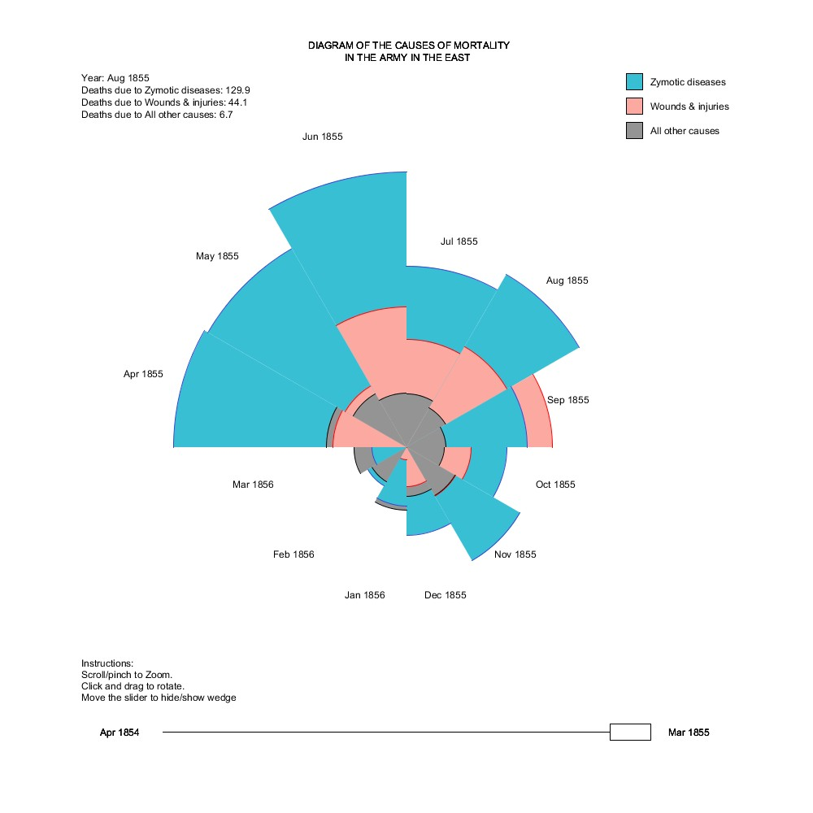
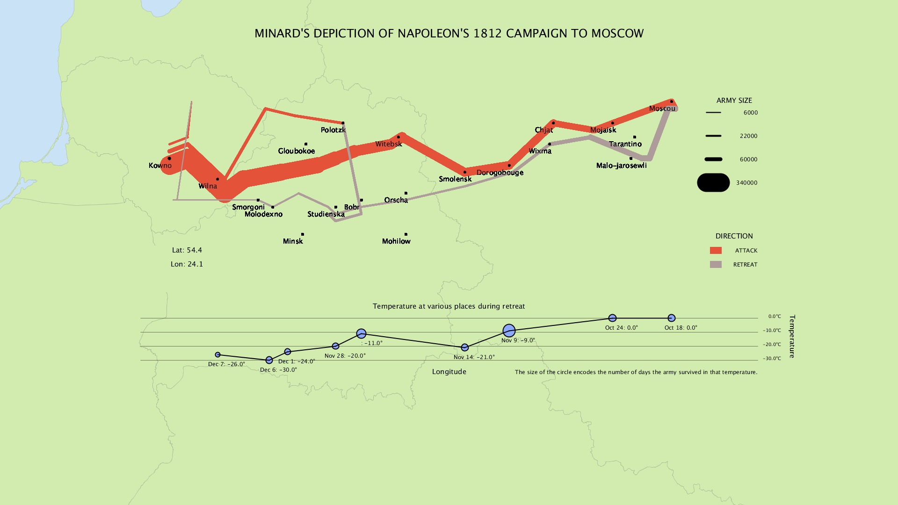
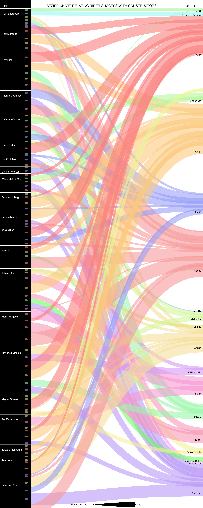
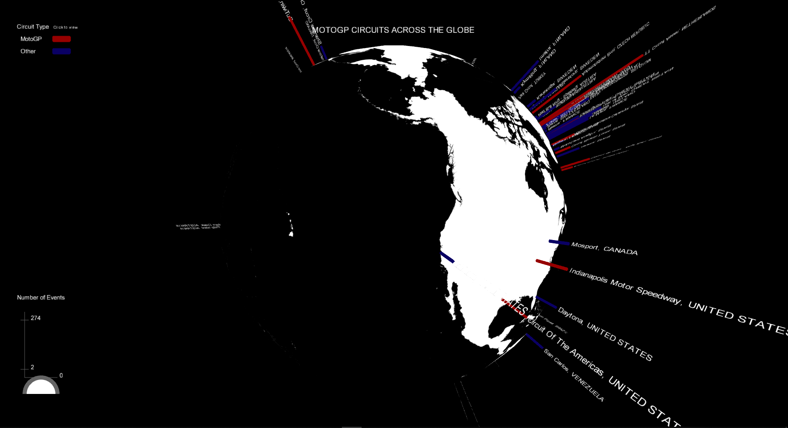

# cs7ds4-data-visualization
Processing Sketches for data viz assignments

# Visualization of Popular Graphs

#### OUTPUTS:

1. Jhon Snow's London Cholera Outbreak

2. Florence Nightingale's Rose Chart

3. Charles Joseph Minard's Map

# Final assignment

4. MotoGP viz.1 Bezier chart.

5. MotoGP viz.2 3D globe bar chart.

